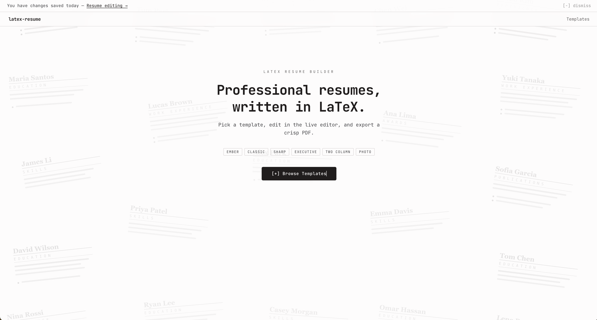

# LaTeX Resume Builder

A minimal web application for creating professional resumes using LaTeX templates. Pick a template, edit in the live editor, and export a crisp PDF.

## Features

- **Template Gallery**: Choose from professionally designed LaTeX resume templates — Ember, Classic, Sharp, Executive, Two Column, Photo, and more
- **Monaco Editor**: Edit LaTeX source with syntax highlighting in a resizable split-pane layout
- **Live PDF Preview**: Compile your LaTeX and preview the result side-by-side
- **Click-to-Edit**: Click any text in the PDF preview to jump to the corresponding source line
- **Draft Autosave**: Edits are saved locally so you can resume where you left off
- **Export**: Download your resume as a PDF or raw `.tex` file

## Screenshots

#### Landing Page


#### Template Gallery


#### LaTeX Editor


## Tech Stack

- **Frontend**: React + TypeScript + Vite
- **Editor**: Monaco Editor
- **LaTeX Compilation**: LaTeX Online (latexonline.cc)
- **Routing**: React Router
- **Styling**: Tailwind CSS

## Getting Started

### Prerequisites

- Node.js v18 or higher

### Installation

1. Clone the repository:
   ```bash
   git clone https://github.com/KtfwyCJ/LaTeX-Resume-Builder.git
   cd LaTeX-Resume-Builder
   ```

2. Install dependencies:
   ```bash
   npm install
   ```

3. Start the development server:
   ```bash
   npm run dev
   ```

4. Open your browser and navigate to `http://localhost:5173`

## Usage

1. On the landing page, click **Browse Templates**
2. Select a template from the gallery
3. The template loads in the editor with a live PDF preview
4. Edit the LaTeX source in the left panel; the right panel shows the compiled PDF
5. Click any text in the PDF to jump to the matching source line
6. Click **Compile** to refresh the preview after edits
7. Download your resume as PDF or `.tex` using the toolbar buttons

## Project Structure

```
src/
├── components/          # Reusable UI components (TemplateGallery, PdfViewer, …)
├── lib/                 # Utilities (LaTeX compiler, resume storage, …)
├── pages/               # App pages (LandingPage, EditorPage)
├── templates/           # LaTeX template source files
└── types.ts             # TypeScript type definitions

api/
└── compile.ts           # Vercel serverless function — LaTeX → PDF
```

## API Endpoints

- `POST /api/compile` — Compile LaTeX source to PDF

## License

MIT License — see LICENSE file for details
