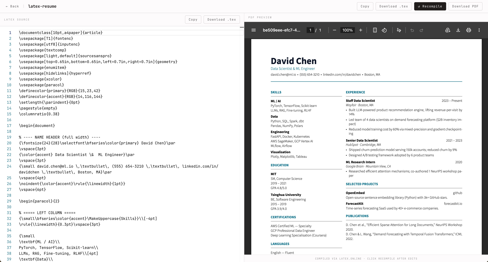
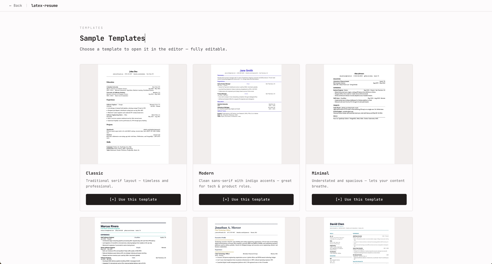

# LaTeX Resume Builder

A modern web application for creating professional resumes using LaTeX templates. Write, edit, and compile LaTeX code directly in your browser, or convert existing PDF resumes to editable LaTeX.

## Features

- **Template Gallery**: Choose from professionally designed LaTeX resume templates (Classic, Modern, Minimal, etc.)
- **Live Editor**: Edit LaTeX code with syntax highlighting and real-time PDF preview
- **PDF Compilation**: Compile LaTeX to PDF using online LaTeX services
- **PDF to LaTeX Conversion**: Upload a PDF resume and convert it to editable LaTeX code using AI
- **Download Options**: Download your resume as PDF or LaTeX source code

## Screenshots

####  LaTeX Editor Page


#### LaTex template samples


## Tech Stack

- **Frontend**: React + TypeScript + Vite
- **LaTeX Compilation**: LaTeX Online (latexonline.cc)
- **PDF Parsing**: PDF.js
- **AI Conversion**: Anthropic Claude API
- **Styling**: Tailwind CSS

## Getting Started

### Prerequisites

- Node.js (v18 or higher)
- npm or yarn

### Installation

1. Clone the repository:
   ```bash
   git clone https://github.com/yourusername/latex-resume.git
   cd latex-resume
   ```

2. Install dependencies:
   ```bash
   npm install
   ```

3. Start the development server:
   ```bash
   npm run dev
   ```

4. (Optional) Configure Anthropic API Key for PDF to LaTeX conversion:
   - Sign up at [Anthropic Console](https://console.anthropic.com/) and obtain your API key
   - Create a `.env` file in the project root directory
   - Add the following line to `.env`:
     ```
     ANTHROPIC_API_KEY=your_api_key_here
     ```
   - Restart the development server if it's already running

5. Open your browser and navigate to `http://localhost:5173`

## Usage

### Creating a Resume from Template

1. On the landing page, click "Browse Templates"
2. Select a template from the gallery (e.g., "Two Column")
3. The template will load in the editor with a preview PDF
4. Edit the LaTeX code in the left panel
5. Click "Compile" to update the PDF preview
6. Download your resume as PDF or LaTeX file

### Converting PDF to LaTeX

1. On the landing page, click "Convert PDF"
2. Upload a PDF resume file
3. The app will analyze the PDF and generate LaTeX code
4. Edit the generated LaTeX as needed
5. Compile and download

### Editing LaTeX

- The editor supports LaTeX syntax highlighting
- Changes are compiled automatically when you modify the code
- Compilation errors are shown below the editor
- Use the "Copy" and "Download .tex" buttons to save your LaTeX source

## Project Structure

```
src/
├── components/          # React components
├── lib/                 # Utilities (LaTeX compiler, PDF parser)
├── pages/               # Main app pages
├── templates/           # LaTeX template files
└── types.ts             # TypeScript type definitions

api/                     # Vercel serverless functions
├── compile.ts           # LaTeX compilation endpoint
└── convert.ts           # PDF to LaTeX conversion endpoint
```

## API Endpoints

- `POST /api/compile`: Compile LaTeX source to PDF
- `POST /api/convert`: Convert PDF images to LaTeX code

## Contributing

1. Fork the repository
2. Create a feature branch
3. Make your changes
4. Run tests: `npm run lint`
5. Submit a pull request

## License

MIT License - see LICENSE file for details
